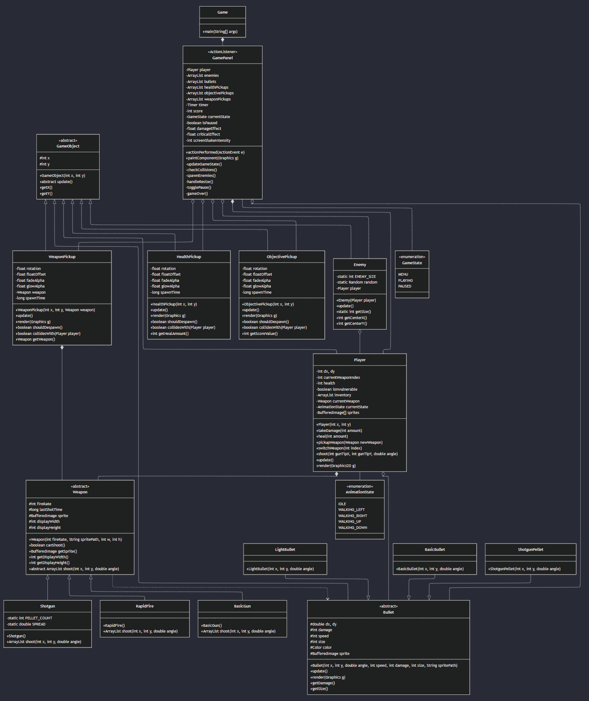

# **Final Project Object-Oriented Programming (N)**

   
  <b style="font-size: 2.5vw">When Mother Nature Claps Back (WMNCB)</b>

| Name | Student ID |
|--|--|
| Faiz Muhammad Kautsar | 5054231013 |
| Shalahuddin Ahmad Cahyoga | 5054231014 |

To visualize the class diagram of our project, here's an ELK-rendered mermaid graph of our class diagram:  

Here's the source:  

A breakdown of some of the OOP principles we applied (non-exhaustive, too many to list lmao):

1. **Inheritance (IS-A Relationship)**
- GameObject <- Player, Enemy, Bullet, WeaponPickup, HealthPickup, ObjectivePickup
- Weapon <- BasicGun, Shotgun, RapidFire
- Bullet <- BasicBullet, ShotgunPellet, LightBullet

2. **Composition (HAS-A Relationship with strong coupling)**
- Game *-- GamePanel (Game has a GamePanel)
- GamePanel *-- Player (GamePanel has a Player)
- Player *-- Weapon (Player has Weapons)
- WeaponPickup *-- Weapon (WeaponPickup has a Weapon)

3. **Aggregation (HAS-A Relationship with loose coupling)**
- GamePanel o-- Enemy, Bullet, HealthPickup, ObjectivePickup, WeaponPickup
- Player o-- Bullet
- Enemy o-- Player

4. **Encapsulation (Information Hiding)**
- Private fields (-):
  - GamePanel: timer, score
  - Player: dx, dy, health, isInvulnerable
  - WeaponPickup: rotation, floatOffset, fadeAlpha
  
- Protected fields (#):
  - GameObject: x, y
  - Weapon: fireRate, lastShotTime
  - Bullet: dx, dy, damage, speed
  
- Public methods (+):
  - GameObject: getX(), getY()
  - Player: takeDamage(), heal(), pickupWeapon()
  - Weapon: canShoot(), getSprite()

5. **Abstraction**

- Abstract classes:
  - GameObject (abstract update())
  - Weapon (abstract shoot())
  - Bullet

- Interfaces/Common behaviors:
  - All pickups have: update(), render(), shouldDespawn(), collidesWith()

6. **Polymorphism**

- Method Overriding:
  - Different shoot() implementations in BasicGun, Shotgun, RapidFire
  - Different update() implementations in Player, Enemy, Bullet
  
- Interface Implementation:
  - All GameObjects implement update()
  - All Weapons implement shoot()
